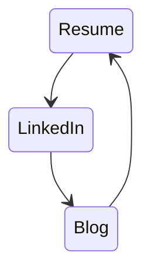

- These are Off campus approaches
	- Your Public profile has to be good along with the domain skills.
- The Profile: 
	- Reuse the same information across

- Use LinkedIn to the fullest
	- Best platform for CSE Grads to network with People working in Computer Science space.
- Do not accept an unpaid internship offer unless you are very desperate.

---
Off campus Internships at:
- Startups
	- Comparatively easier to land.
	- Can try different domains/tech in the same company after being landed one.
	- Higher Work load, sometimes toxic work culture.
	- Allows remote opportunity.
	- Higher chances of landing a Full time job in the same company.
- MNC
	- Comparatively harder to land.
	- Better chances of landing a job in a different company after completion.
---

## Prerequisite

- No presumptions:
	- Never `Im not capable of getting this awesome internship`
	- There is always an Opportunity waiting for you, you just have to try hard enough (Given that you have made your best efforts in building your profile).
- Resume with 2-3 projects
	- Attached a real resume which got selected in cyber security startup for 10K per month.
- Proper LinkedIn profile using the same details from Resume.
- Sabr (Patience)
- Optional: Community Help: like IT Blogs.
	- Optional for Internship but Required for a Full time Job.
	- Excellent impression to the HRs.
	- Blog ideas:
		- the 2-3 projects that you have made.
		- Any framework, tool or CLI tool you used.
		- a research you did recently on a certain topic.
		- Summary of any article or a book you read 
		- Any complex programming question that you solved. 
		- Note that all the blogs needs to be from Computer Science field.
	- The same blogs can be posted in your LinkedIn profile to gather HR and Company's attention.


---
## Approaches
1. LinkedIn Job 
	- Search "Internships", set location to "India"
	- Very common approach, hence:
		- too much competition
		- lesser chances of selection
2. LinkedIn Company Search: 
	1. **Startups:** Filters - Companies, `Size`: under 10 employees, `Industry`: Your Choice, `Location`: India.
		- Reach out to the Founders and HRs directly.
		- example: see below.
	2. **MNC:**  Filters - Companies, `Size`: >1000 employees, `Industry`: Your Choice, `Location`: India. `Job listings on LinkedIn`: Yes
	- Least common approach, hence:
		- lesser competition at the cost of Repetitive task of networking with every HR and Founders on LinkedIn and their responses.
2. Google search 'Top cyber security startups'


```
Example Message:
Hi Elon, I'm Zia, a CS student at XYZ University passionate about cybersecurity, seeking internship opportunities.
I have worked on:
- prj 1
- prj 2

 Can we connect to discuss potential openings at SecureTech? Thanks
```
## Takeaways:
- Complete 2-3 Projects.
- Build the Resume
- Complete LinkedIn profile
- Reach out People on LinkedIn


---
---
Experiences are of my own.

There are approaches other than the one's mentioned above that would be valid too.

*By: Sayyed Zia Ur Rehman*
*Dated: 1st June 2024*